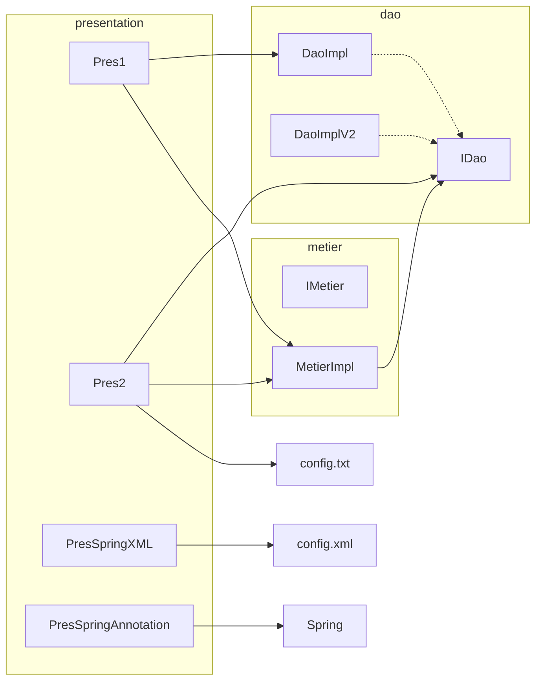

# TP — Inversion de contrôle (IoC)

Travaux pratiques JEE illustrant l’**inversion de contrôle** et l’**injection de dépendances** : du couplage fort (`new`) à une configuration externe (fichier, puis conteneur Spring).

## Objectifs

- Séparer la couche **présentation** de la couche **métier** et **DAO**.
- Dépendre d’**interfaces** (`IDao`, `IMetier`) plutôt que d’implémentations concrètes.
- Comparer quatre façons de fournir les dépendances :
  1. Instanciation manuelle dans le code
  2. Instanciation par réflexion + fichier de configuration
  3. Conteneur Spring (configuration XML)
  4. Conteneur Spring (annotations / scan de composants)

## Prérequis

- **JDK 17**
- **Maven 3.x**

## Structure du projet

```
src/main/java/net/pres/
├── dao/
│   ├── IDao.java          # Contrat d’accès aux données
│   └── DaoImpl.java       # Implémentation « base de données »
├── ext/
│   └── DaoImplV2.java     # Implémentation « capteur »
├── metier/
│   ├── IMetier.java       # Contrat métier
│   └── MetierImpl.java    # Calcul basé sur IDao
└── pres/
    ├── Pres1.java                 # Couplage fort
    ├── Pres2.java                 # IoC manuelle (config.txt)
    ├── PresSpringXML.java         # Spring + config.xml
    └── PresSpringAnnotation.java  # Spring + @Component

src/main/resources/
└── config.xml             # Beans Spring (XML)

config.txt                 # Classes DAO / métier pour Pres2 (racine du projet)
```

## Modèle métier

| Composant    | Rôle |
|-------------|------|
| `IDao`      | Fournit une valeur (`getData()`). |
| `DaoImpl`   | Simule une source « base de données » (affiche `version base de données`). |
| `DaoImplV2` | Simule une source « capteur » (affiche `version capteur`). |
| `IMetier`   | Expose `calcul()`. |
| `MetierImpl`| Utilise `IDao` pour lire une température et appliquer une formule. |

`MetierImpl` accepte l’injection du DAO :

- **Constructeur** : `MetierImpl(IDao iDao)` — utilisé par Spring XML et les annotations (`@Qualifier("d")`).
- **Setter** : `setDao(IDao iDao)` — utilisé par `Pres2` (réflexion).

## Les quatre présentations

### 1. `Pres1` — sans IoC

Le présentateur crée lui-même les objets :

```java
MetierImpl metier = new MetierImpl(new DaoImpl());
```

Couplage fort : changement d’implémentation DAO = modification du code de présentation.

### 2. `Pres2` — IoC « maison »

Lit `config.txt` à la racine du projet :

```text
net.pres.dao.DaoImpl
net.pres.metier.MetierImpl
```

- Charge les classes par réflexion (`Class.forName`, `newInstance`).
- Injecte le DAO via `setDao` sur le métier.
- Pour tester `DaoImplV2`, remplacer la première ligne par `net.pres.ext.DaoImplV2`.

**Important :** lancer la JVM avec le répertoire de travail à la racine du projet pour que `config.txt` soit trouvé.

### 3. `PresSpringXML` — conteneur Spring (XML)

Fichier `src/main/resources/config.xml` :

- Bean `d` → `DaoImpl`
- Bean `metier` → `MetierImpl`, avec `<constructor-arg ref="d"/>`

Le contexte `ClassPathXmlApplicationContext` résout `IMetier` et injecte les dépendances.

### 4. `PresSpringAnnotation` — conteneur Spring (annotations)

- `@Component("d")` sur `DaoImpl`, `@Component("metier")` sur `MetierImpl`.
- Scan du package `net.pres` via `AnnotationConfigApplicationContext("net.pres")`.
- Injection constructeur : `@Qualifier("d")` sur `MetierImpl`.

Pour basculer vers le capteur, il faudrait par exemple qualifier `DaoImplV2` et ajuster `@Qualifier` dans `MetierImpl` (ou utiliser `@Primary` / configuration dédiée).

## Compilation et exécution

```bash
# Compilation
mvn compile

# Exécution (depuis la racine du projet)
mvn exec:java -Dexec.mainClass=net.pres.pres.Pres1
mvn exec:java -Dexec.mainClass=net.pres.pres.Pres2
mvn exec:java -Dexec.mainClass=net.pres.pres.PresSpringXML
mvn exec:java -Dexec.mainClass=net.pres.pres.PresSpringAnnotation
```

Sous IntelliJ IDEA : exécuter la classe `main` souhaitée ; pour `Pres2`, définir le **Working directory** sur la racine du module.

## Dépendances

- **Spring Framework 6.1.6** : `spring-core`, `spring-beans`, `spring-context` (voir `pom.xml`).

## Schéma des dépendances



## Fichiers générés

Le dossier `target/` contient les classes compilées ; il ne doit pas être versionné (artefacts Maven).

## Auteur / contexte

Travaux pratiques **Master JEE** — module inversion de contrôle et Spring.
